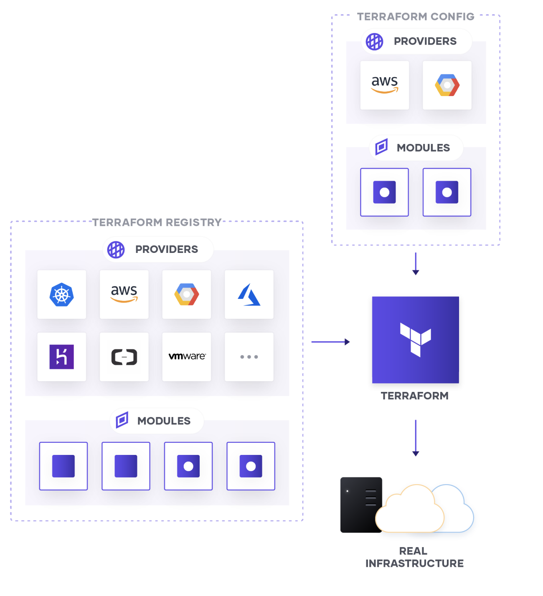

# Terraform

Terraform is an IaC tool that allows users to provision immutable infrastructure using human-readable and declarative files.

A Terraform configuration is idempotent, means applying it multiple times will not change the result.

## Installation

Install Terraform on Windows with choco

```
choco install terraform
```

Install Terraform on MacOS

```
brew install terraform
```

```
choco install graphviz
```

To show terraform dependency graph

```
terraform graph | dot -Tsvg > graph.svg
```

## Terraform Commands

- terraform init : initialize your code to download the requirements mentioned in your code.
- terraform plan : review changes and choose whether to simply accept them.
- terraform apply : accept changes and apply them against real infrastructure.
- terraform show
- terraform destroy : destroy all your created infrastructure.

## Mutable vs Immutable Infrastructure

- Terraform uses immutable infrastructure approach, meaning when terraform detect there is a change in state, instead of updating existing resources, they are destroyed and recreated.

- The downside of mutable infrastructure approach is that, it introduce risk and complexity into the upgrading process. Suppose we want to update multiple existing server, however, they are on different old versions, or they simply don't meet the upgrade requirements. Immutable approach eliminate this risk.

- However, the key to making immutable infrastructure approach is to externalize the data, so that data is not destroyed along with the old infrastructure during the upgrading process.

## Terraform State

Terraform must store state about your managed infrastructure and configuration. This state is used by Terraform to map real world resources to your configuration, keep track of metadata, and to improve performance for large infrastructures.

This state is stored by default in a local file named "terraform.tfstate", but it can also be stored remotely, which works better in a team environment.

## Blocks

A block is a container for other content. Examples of blocks include:

- resource
- module
- variable
- module

## Variables

### Variable Definition Precedence

Terraform loads variables in the following order, with later sources taking precedence over earlier ones:

- Environment variables
- The terraform.tfvars file, if present.
- The terraform.tfvars.json file, if present.
- Any _.auto.tfvars or _.auto.tfvars.json files, processed in lexical order of their filenames.
- Any -var and -var-file options on the command line, in the order they are provided. (This includes variables set by a Terraform Cloud workspace.) (highest priority)

## Meta-Arguments

Meta-Arguments are special constructs in Terraform which are available for Resource and Module Block.

Examples of meta-arguments include:

- `depends_on` (for explictly declaring dependencies, see resource-dependencies folder)
- `count` (for ceating multiple resources with the same config)
- `for_each` (alternative way to create multiple resources, uses map or set(string))
- `provider` (specifies provider to be used for a resource, can include alias to differentiate providers)
- `lifecycle` (allows customization to the default terraform lifecycle like ignore_changes or create_before_destroy, prevent_destroy)

## Providers



Providers allow Terraform to interact with cloud providers, SaaS providers, and other APIs. [Terraform Registry](https://registry.terraform.io/) makes it easy for users to browse the list of available providers and add to their configuration to use. Terraform providers can be differentiated into official, verified and community providers depending on the author of the plugin.

- we can use `alias` meta-argument to identify multiple configurations for the same provider.

```
# The default provider configuration; resources that begin with `aws_` will use
# it as the default, and it can be referenced as `aws`.
provider "aws" {
  region = "us-east-1"
}

# Additional provider configuration for west coast region; resources can
# reference this as `aws.west`.
provider "aws" {
  alias  = "west"
  region = "us-west-2"
}
```

- we can use `version` in `required_providers` block to explictly declare a version constraint for a provider.

```
terraform {
  required_providers {
    mycloud = {
      source  = "mycorp/mycloud"
      version = "~> 1.0"
    }
  }
}
```

## Data Sources

Data sources allow Terraform to use information _defined outside of Terraform_, defined by another separate Terraform configuration, or modified by functions.

## References

- [Overview - Configuration Language | Terraform by HashiCorp](https://www.terraform.io/language)

- [Understanding Meta-Arguments in Terraform - Knoldus Blogs](https://blog.knoldus.com/meta-arguments-in-terraform/)
