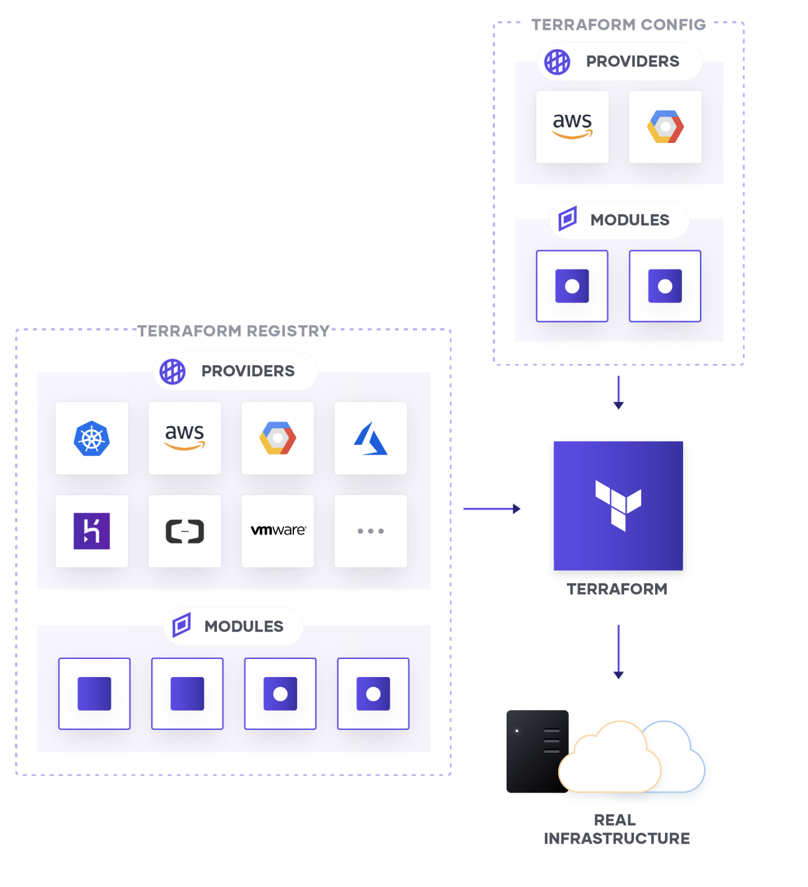

# Terraform Fundamentals and Terraform Associate Certification Prep

## Official Terraform Associate Prep

- [Study Guide - Terraform Associate Certification | Terraform - HashiCorp Learn](https://learn.hashicorp.com/tutorials/terraform/associate-study?in=terraform/certification)
- [Sample Questions - Terraform Associate Certification | Terraform - HashiCorp Learn](https://learn.hashicorp.com/tutorials/terraform/associate-questions?in=terraform/certification)
- [Exam Review - Terraform Associate Certification | Terraform - HashiCorp Learn](https://learn.hashicorp.com/tutorials/terraform/associate-review?in=terraform/certification)

## Introduction

Terraform is an IaC tool that allows users to provision immutable infrastructure using human-readable and declarative files.

A Terraform configuration is idempotent, means applying it multiple times will not change the result.

Terraform is available for macOS, FreeBSD, OpenBSD, Linux, Solaris, Windows.

Most Terraform configurations are written in the native Terraform language syntax. Terraform also supports an alternative syntax that is JSON-compatible. This syntax is useful when generating portions of a configuration programmatically, since existing JSON libraries can be used to prepare the generated configuration files. Terraform expects native syntax for files named with a `.tf` suffix, and JSON syntax for files named with a `.tf.json` suffix.

## Installation

Install Terraform on Windows with choco

```
choco install terraform
```

Install Terraform on MacOS

```
brew install terraform
```

```
choco install graphviz
```

To show terraform dependency graph

```
terraform graph | dot -Tsvg > graph.svg
```

## Terraform Commands

**Initializing**

- terraform init : initialize your code to download the requirements mentioned in your code. Rerun init whenever a new plugin is introduced
- terraform get: download and update modules mentioned in the root module.

_Init Options_

- `-input=true`: ask for input if necessary
- `-lock=false`: disable state lock
- `-lock-timeout`: override the time Terraform will wait to acquire a state lock. The default is 0s (zero seconds), which causes immediate failure if the lock is already held by another process.
- `-no-color`: disable color codes in the command output.
- `-upgrade`: Opt to upgrade modules and plugins as part of their respective installation steps.

**Provisioning**

- `terraform plan` : review changes and choose whether to simply accept them.
- `terraform apply` : accept changes and apply them against real infrastructure.
- `terraform destroy` / `terraform apply -destroy` : destroy all your created infrastructure.

* A `terraform plan` is **NOT a required step** before running a `terraform apply`. If no explicit plan file is given on the command line, `terraform apply` will create a new plan automatically and prompt for approval to apply it.

_Plan Options_

- `-refresh=false`: disable default behavior to synce state before config changes
- `-replace=ADDRESS`: plan to replace single resource
- `-target=ADDRESS`: focus planning on target resource
- `-var 'NAME=VALUE`: set single input variable
- `-var-file=FILENAME`: set values from variable file
- `-out=FILE`: save the generated plan to a file on disk

To perform a dry-run of your Terraform configuration, you should run a `terraform plan`.

`terraform apply -refresh-only` is used to update the state file for existing resources deployed with Terraform. This would be useful if somebody made a change outside of Terraform, and you needed to reflect that change in the state file.

_Apply Options_

- `-auto-approve`
- `-compact-warnings`
- `input-false`
- `-json`
- `-lock=false`
- `-lock-timeout=DURATION`
- `-no-color`
- `-parallelism=n`

**All plan , apply and destroy commands run refresh first, prior to any other work unless explicitly disabled.**

**Writing and Modifying Code**

- `terraform console`: provides an interactive console for evaluating expressions
- `terraform fmt`: format config files to a canonical format and style
- `terraform validate`: validates the configuration files in a directory, referring only to the configuration and not accessing any remote services

_fmt Options_

- `-list=false`
- `-write=false`
- `-diff`
- `-check`
- `-recursive`

_Validate Options_

- `-json`
- `-no-color`

**Inspecting**

- `terraform graph` : generate a visual representation of either a configuration or execution plan in the DOT format
- `terraform output`: extract the value of an output variable from the state file.
- `terraform show`: provide human-readable output from a state or plan file
- `terraform state show`: show the attributes of a single resource in the Terraform state.
- `terraform state list`: list resources within a Terraform state.

**Moving Resources**

- `terraform state mv`: used in the less common situation where you wish to retain an existing remote object but track it as a different resource instance address in Terraform, such as if you have **renamed a resource block** or you have moved it into a different module in your configuration.

If you change the name of the resources, there is no way for Terraform to determine this change unless we use the `state mv` command. Otherwise, Terraform will delete the old resource and create a new resource.

This command can also move to a destination address in a completely different state file.

**Importing**

- `terraform import`: import existing resources into Terraform state management

The current implementation of Terraform import can only import resources into the state. It does not generate a configuration. Because of this, and prior to running `terraform import`, it is necessary to manually write a resource configuration block for the resource to which the imported object will be mapped.

**The terraform import command currently can only import one resource at a time.**

The import command can import resources into **modules as well as directly into the root of your state.**

First, add the resources to the configuration file:

```hcl
resource "aws_instance" "example" {
  # ...instance configuration...
}
```

Then run the following command:

```bash
terraform import aws_instance.example i-abcd1234
```

**Forcing Re-creation**

- `terraform taint`: informs Terraform that a particular object has become degraded or damaged.

**Managing Workspaces**
see [Workspaces](#workspaces)

### Terraform Apply

The terraform apply -refresh-only command is used to reconcile the state Terraform knows about (via its state file) with the real-world infrastructure. This can be used to detect any drift from the last-known state, and to **update the state file**.

### Terraform Taint and Replace

HashiCorp deprecated the terraform taint command in v0.15.2. If you want to force replacement of an object even though there are no configuration changes, use the terraform plan or terraform apply command with the -replace option instead. If you are using an older version of Terraform, continue using the terraform taint command.

```
terraform apply -replace=<RESOURCE_NAME>
```

You could also use terraform destroy -target <virtual machine> and destroy only the virtual machine and then run a terraform apply again.

---

[Provisioners | Terraform by HashiCorp](https://www.terraform.io/language/resources/provisioners/syntax#creation-time-provisioners)

If a resource is successfully created but fails during provisioning, Terraform will error and mark the resource as "tainted". A resource that is tainted has been physically created, but can't be considered safe to use since provisioning failed.

Terraform also does not automatically roll back and destroy the resource during the apply when the failure happens because that would go against the execution plan: the execution plan would've said a resource will be created but does not say it will ever be deleted.

### Terraform Console

The `terraform console` command provides an interactive console for evaluating expressions.

#### Scripting

The terraform console command can be used in non-interactive scripts by piping newline-separated commands to it. Only the output from the final command is printed unless an error occurs earlier.

```bash
echo 'aws_iam_user.cloud[6].name' | terraform console
```

## Mutable vs Immutable Infrastructure

- Terraform uses immutable infrastructure approach, meaning when terraform detect there is a change in state, instead of updating existing resources, they are destroyed and recreated.

- The downside of mutable infrastructure approach is that, it introduce risk and complexity into the upgrading process. Suppose we want to update multiple existing server, however, they are on different old versions, or they simply don't meet the upgrade requirements. Immutable approach eliminate this risk.

- However, the key to making immutable infrastructure approach is to externalize the data, so that data is not destroyed along with the old infrastructure during the upgrading process.

## Terraform State

Terraform must store state about your managed infrastructure and configuration. This state is used by Terraform to map real world resources to your configuration, keep track of metadata, and to improve performance for large infrastructures.

This state is stored by default in a local file named "terraform.tfstate", but it can also be stored remotely, which works better in a team environment.

### Purpose of Terraform State

- mapping Terraform config to the real world resource
- track metadata such as resource dependencie and determine dependency order
- increase performance by storing cache of the attribute values for all resources in the state.

If there is no state file associated with a Terraform configuration file, a `terraform apply` will create the resources defined in the configuration file. This is a normal workflow during the first terraform apply that is executed against a configuration file. This, of course, assumes that the directory has been initialized using a `terraform init`.

### State Locking

State locking prevents others from acquiring the lock and potentially corrupting your state. If Terraform didn't use state locking, multiple people could try to make changes to your infrastructure and corrupt the state file.

#### force-unlock

We can use `force-unlock` command to manually unlock the state for the defined configuration. The behavior of this lock is dependent on the backend being used. **Local state files cannot be unlocked by another process.**

### Delegation and Teamwork

Remote state allows teams to share infrastructure resources in a read-only way without relying on any additional configuration store.

Remote state allows you to share output values with other configurations. This allows your infrastructure to be decomposed into smaller components.

Put another way, remote state also allows teams to share infrastructure resources in a read-only way without relying on any additional configuration store.

For example, a core infrastructure team can handle building the core machines, networking, etc. and can expose some information to other teams to run their own infrastructure. As a more specific example with AWS: you can expose things such as VPC IDs, subnets, NAT instance IDs, etc. through remote state and have other Terraform states consume that.

### Situational Questions

You have a Terraform configuration file with no defined resources. However, there is a related state file for resources that were created on AWS. When you run `terraform apply`, since there is a state file with resources, Terraform will match the desired state of no resources since the configuration file doesn't include any resources. Therefore, all resources defined in the state file will be destroyed.

## Blocks

A block is a container for other content. Examples of blocks include:

- resource
- module
- variable
- module

### Dynamic Blocks

[Best Practices For Dynamic Blocks](https://www.terraform.io/language/expressions/dynamic-blocks#best-practices-for-dynamic-blocks)

You can dynamically construct repeatable nested blocks like `setting` using a special `dynamic` block type, which is supported inside `resource, data, provider, and provisioner` blocks

### Connection Blocks

Connection blocks don't take a block label, and can be nested within either a `resource` or a `provisioner`.

## Variables

## Environment Variables

[Environment Variables | Terraform by HashiCorp](https://www.terraform.io/cli/config/environment-variables#environment-variables)

We can use Terraform environment variables to change some of Terraform's default behaviors in unusual situations, or to increase output verbosity for debugging.

- TF_LOG: enable detailed logs to appear on stderr by log levels; `TRACE, DEBUG, INFO, WARN, ERROR`. `TRACE` is the most verbose and it is the default if TF_LOG is set to something other than a log level name.
- TF_LOG_PATH: write logs to external file
- TF_INPUT
- TF_VAR_name: set environment variables such as `TF_VAR_region=us-west-1`
- TF_CLI_ARGS and TF_CLI_ARGS_name
  - **The flag TF_CLI_ARGS affects all Terraform commands**. If you specify a named command in the form of TF_CLI_ARGS_name then it will only affect that command. As an example, to specify that only plans never refresh, you can set TF_CLI_ARGS_plan="-refresh=false".
- TF_DATA_DIR
- TF_WORKSPACE
- TF_IN_AUTOMATION
- TF_REGISTRY_DISCOVERY_RETRY
- TF_REGISTRY_CLIENT_TIMEOUT
- TF_CLI_CONFIG_FILE
- TF_IGNORE

## Local Values

A local value assigns a name to an expression, so you can use it multiple times within a module without repeating it.

The expression of a local value can refer to other locals, but as usual reference cycles are not allowed. That is, a local cannot refer to itself or to a variable that refers (directly or indirectly) back to it.

### Variable Definition Precedence

Terraform loads variables in the following order, with later sources taking precedence over earlier ones:

- Environment variables
- The terraform.tfvars file, if present.
- The terraform.tfvars.json file, if present.
- Any _.auto.tfvars or _.auto.tfvars.json files, processed in lexical order of their filenames.
- Any -var and -var-file options on the command line, in the order they are provided. (This includes variables set by a Terraform Cloud workspace.) (highest priority)

## Meta-Arguments

Meta-Arguments are special constructs in Terraform which are available for Resource and Module Block.

Examples of meta-arguments include:

- `depends_on` (for explictly declaring dependencies, see resource-dependencies folder)
- `count` (for ceating multiple resources with the same config)
- `for_each` (alternative way to create multiple resources, uses map or set(string))
- `provider` (specifies provider to be used for a resource, can include alias to differentiate providers)
- `lifecycle` (allows customization to the default terraform lifecycle like ignore_changes or create_before_destroy, prevent_destroy)

### for_each

The `for_each` meta-argument accepts a map or a set of strings, and creates an instance for each item in that map or set.

In blocks where for_each is set, an additional each object is available in expressions, so you can modify the configuration of each instance. This object has two attributes:

- each.key
- each.value

## Providers



Providers allow Terraform to interact with cloud providers, SaaS providers, and other APIs. [Terraform Registry](https://registry.terraform.io/) makes it easy for users to browse the list of available providers and add to their configuration to use. Terraform providers can be differentiated into official, verified and community providers depending on the author of the plugin.

- we can use `alias` meta-argument to identify multiple configurations for the same provider.

```
# The default provider configuration; resources that begin with `aws_` will use
# it as the default, and it can be referenced as `aws`.
provider "aws" {
  region = "us-east-1"
}

# Additional provider configuration for west coast region; resources can
# reference this as `aws.west`.
provider "aws" {
  alias  = "west"
  region = "us-west-2"
}
```

- we can use `version` in `required_providers` block to explictly declare a version constraint for a provider.

```
terraform {
  required_providers {
    mycloud = {
      source  = "mycorp/mycloud"
      version = "~> 1.0"
    }
  }
}
```

After running `terraform init`, the provider plugins are downloaded and stored in the `.terraform/providers` directory in the current working directory.

### Alias

To create multiple configurations for a given provider, include multiple `provider` blocks with the same provider name. For each additional non-default configuration, use the `alias` meta-argument to provide an extra name segment.

### Modules

When using modules, it's common practice to **declare variables outside of the module and pass the value(s) to the child module when it is called by the parent/root module**. However, it's perfectly acceptable to declare a variable inside of a module if you needed. Any variables declared inside of a module are only directly referencable within that module. You can't directly reference that variable outside of the module. You can, however, create an output in the module to export any values that might be needed outside of the module.

#### Module Sources

##### Local Paths

A local path must begin with either `./` or `../` to indicate that a local path is intended, to distinguish from a module registry address.

```
module "x" {
  source = "./x"
}

module "y" {
  source = "../y"
}

```

##### Generic Git Repository

Arbitrary Git repositories can be used by prefixing the address with the special `git::` prefix.

```
module "vpc" {
  source = "git::https://example.com/vpc.git"
}

module "storage" {
  source = "git::ssh://username@example.com/storage.git"
}
```

Terraform will also recongize unprefixed `github.com` and `bitbucket.org` url.

### Providers Within Modules

Providers can be passed down to descendent modules in two ways: either _implicitly_ through inheritance, or _explicitly_ via the `providers` argument within a `module` block.

#### Version Constraints

Version constraints are supported only for modules installed from a module registry, such as the public Terraform Registry or Terraform Cloud's private module registry.

#### Publishing Modules

Anyone can publish and share modules on the Terraform Registry.

The requirements for publishing a module is as follows:

- The module must be on GitHub and must be a public repo for public registry.
- Named `terraform-<PROVIDER>-<NAME>`. Module repositories must use this three-part name format. **The `<NAME>` segment can contain additional hyphens.**
- The GitHub repository description is used to populate the short description of the module.
- Standard module structure. The module must adhere to the standard module structure. This allows the registry to inspect your module and generate documentation, track resource usage, parse submodules and examples, and more.
- x.y.z tags for releases. The registry uses tags to identify module versions. Release tag names must be a semantic version, which can optionally be prefixed with a v.

### Downloading Modules

If the acceptable version numbers are not explicitly declared and there is an existing module downloaded in your local, Terraform **will not download the latest version of the module. It will reuse the existing one.**

## Data Sources

Data sources allow Terraform to use information _defined outside of Terraform_, defined by another separate Terraform configuration, or modified by functions.

**It is important to consider that Terraform reads from data sources during the plan phase and writes the result into the plan.**

## Workspaces

Terraform starts with a single workspace named "default".

Named workspaces allow conveniently switching between multiple instances of a single configuration within its single backend.

A common use for multiple workspaces is to create a parallel, distinct copy of a set of infrastructure in order to test a set of changes before modifying the main production infrastructure. For example, a developer working on a complex set of infrastructure changes might create a new temporary workspace in order to freely experiment with changes without affecting the default workspace. Non-default workspaces are often related to feature branches in version control.

```bash
# list workspace
terraform workspace list

# create new workspace
terraform workspace new <WORKSPACE_NAME>

# show current workspace
terraform workspace show

# switch workspace
terraform workspace select <WORKSPACE_NAME>

# delete workspace
terraform workspace delete <WORKSPACE_NAME>

```

To get the name of the terraform workspace, we can use `terraform.workspace`.

When using multiple workspaces, the state files are stored in directories inside `terraform.tfstate.d`.

### Terraform Cloud vs. Terraform CLI Workspaces

Both Terraform Cloud and Terraform CLI have features called workspaces, but they function differently.

**Terraform Cloud workspaces are required.** They represent all of the collections of infrastructure in an organization. They are also a major component of role-based access in Terraform Cloud. You can grant individual users and user groups permissions for one or more workspaces that dictate whether they can manage variables, perform runs, etc. You cannot manage resources in Terraform Cloud without creating at least one workspace.

In addition to the basic Terraform content, Terraform Cloud keeps some additional data for each workspace:

- State versions: Each workspace retains backups of its previous state files. Although only the current state is necessary for managing resources, the state history can be useful for tracking changes over time or recovering from problems.
- Run history: When Terraform Cloud manages a workspace's Terraform runs, it retains a record of all run activity, including summaries, logs, a reference to the changes that caused the run, and user comments.

Terraform CLI workspaces are associated with a specific working directory and isolate multiple state files in the same working directory, letting you manage multiple groups of resources with a single configuration. The Terraform CLI does not require you to create CLI workspaces.

Workspaces in OSS are often used within the same working directory while workspaces in Enterprise/Cloud are often (but not required) mapped to unique repos.

## Expressions

### Types

The Terraform language uses the following types for its values: string, number, bool, list (or tuple), map (or object), null.

Take note that square brackets are used to initialize list ie. `["us-west-1a", "us-west-1c"]` and curly braces for map ie. `{name = "Mabel", age = 52}`

#### Primitive Types

- String
- Number
- Bool

#### Collection Types

A collection type allows multiple values of one other type to be grouped together as a single value.

- list: a sequence of values identified by consecutive whole numbers starting with zero.
- map: a collection of values where each is identified by a string label.
- set: a collection of unique values that do not have any secondary identifiers or ordering.

#### Structural Types

A structural type allows multiple values of several distinct types to be grouped together as a single value.

- object: a collection of named attributes that each have their own type.
- tuple: a sequence of elements identified by consecutive whole numbers starting with zero, where each element has its own type.

#### Type Conversion

The Terraform language will automatically convert number and bool values to string values when needed, and vice-versa as long as the string contains a valid representation of a number or boolean value.

Whenever possible, Terraform converts values between similar kinds of complex types if the provided value is not the exact type requested.

- Objects and maps are similar.
- Tuples and lists are similar.
- Sets are almost similar to both tuples and lists: When a list or tuple is converted to a set, duplicate values are discarded and the ordering of elements is lost. When a set is converted to a list or tuple, the elements will be in an arbitrary order. If the set's elements were strings, they will be in lexicographical order; sets of other element types do not guarantee any particular order of elements.

### Splat Expressions

- A splat expression provides a more concise way to express a common operation that could otherwise be performed with a for expression.

```

[for o in var.list : o.id]
# is equivalent to
var.list[*].id

```

## Resources Graph

[Resource Graph | Terraform by HashiCorp](https://www.terraform.io/internals/graph#walking-the-graph)

[Applying Graph Theory to Infrastructure as Code - YouTube](https://www.youtube.com/watch?v=Ce3RNfRbdZ0)

By default, up to 10 nodes in the graph will be processed concurrently.

Terraform analyzes any expressions within a resource block to find references to other objects and treats those references as implicit ordering requirements when creating, updating, or destroying resources.

## Backend

Backends define where Terraform's state snapshots are stored.

List of supported backend includes:

- local
- remote
- artifactory (no state lock)
- azurerm
- consul
- cos
- etcd (no state lock)
- etcdv3
- gcs
- http
- kuberenetes
- manta
- oss
- pg
- s3
- swift

### Backend Initialization

During init, the **root configuration directory** is consulted for backend configuration and the chosen backend is initialized using the given configuration settings.

### Backend Configuration

We do not need to specify every required argument in the backend configuration. Omitting certain arguments may be desirable to avoid storing secrets, such as access keys, within the main configuration.

We can provide the remaining arguments interactively, via an external file using `-backend-config=PATH`, or command-line key/value pairs `-backend-config="KEY=VALUE"`

Backends are configured with a nested `backend` block within the top-level `terraform` block. There are some important limitations on backend configuration:

- A configuration can only provide one backend block.

- A backend block cannot refer to named values (like input variables, locals, or data source attributes).

### Enhanced Backend

**Note:** In Terraform versions prior to 1.1.0, backends were also classified as being 'standard' or 'enhanced', where the latter term referred to the ability of the remote backend to store state and perform Terraform operations. This classification has been removed, clarifying the primary purpose of backends. Using an enhanced storage backend allows you to execute your Terraform on infrastructure either locally or in Terraform Cloud.

## Provisioners

Provisioners can be used to model specific actions on the local machine or on a remote machine in order to prepare servers or other infrastructure objects for service.

It is primarily designed as a **last resort measure** for implementing certain behaviors that can't be directly represented in Terraform's declarative model. For most common situations there are better alternatives like user_data in AWS EC2 or tools like Chef/Ansible/Saltstack built specifically for configuration management.

### How to use Provisioners

add a `provisioner` block inside the resource block of a compute instance.

```hcl
resource "aws_instance" "web" {
  # ...

  provisioner "local-exec" {
    command = "echo The server's IP address is ${self.private_ip}"
  }
}
```

### Creation-Time Provisioners

By default, provisioners run when the resource they are defined within is created. **Creation-time provisioners are only run during creation, not during updating or any other lifecycle.**

If a creation-time provisioner fails, the resource is marked as tainted. A tainted resource will be planned for destruction and recreation upon the next `terraform apply`.

### Destroy-Time Provisioners

If `when = destroy` is specified, the provisioner will run when the resource it is defined within is destroyed.

A destroy-time provisioner within a resource that is **tainted will not run**. This includes resources that are marked tainted from a failed creation-time provisioner or tainted manually using `terraform taint`.

### file

The file provisioner is used to copy files or directories from the machine executing Terraform to the newly created resource. The file provisioner supports both ssh and winrm type connections.

### local-exec

The local-exec provisioner invokes a local executable after a resource is created. This invokes a process on the machine running Terraform, not on the resource.

### remote-exec

The remote-exec provisioner invokes a script on a remote resource after it is created.

The remote-exec provisioner requires a connection and supports both `ssh` and `winrm`.

## Sensitive Values

Whenever possible, **use environment variables** since these cannot end up in state files or in Sentinel mocks. (Environment variables can end up in log files if TF_LOG is set to TRACE.)

Setting a variable as sensitive prevents Terraform from showing its value in the `plan` or `apply` output, when you use that variable elsewhere in your configuration. **Terraform will still record sensitive values in the state**, and so anyone who can access the state data will have access to the sensitive values in cleartext.

## Style Conventions and Syntax

[Style Conventions - Configuration Language | Terraform by HashiCorp](https://www.terraform.io/language/syntax/style)

- Indent two spaces for each nesting level.
- When multiple arguments with single-line values appear on consecutive lines at the same nesting level, align their equals signs

### Comments

- `#` and `//` can be used for single line comment
- `/*` and `*/` can be used for multi-line comments

## Terraform Cloud

[Terraform full feature pricing table_v2](https://www.datocms-assets.com/2885/1602500234-terraform-full-feature-pricing-tablev2-1.pdf)

Terraform Cloud is available as **a hosted service** at https://app.terraform.io. Small teams can sign up for free to connect Terraform to version control, share variables, run Terraform in a stable remote environment, and securely store remote state. Paid tiers allow you to add more than five users, create teams with different levels of permissions, enforce policies before creating infrastructure, and collaborate more effectively.

You can use modules from a **private registry**, like the one provided by Terraform Cloud. Private registry modules have source strings of the form <HOSTNAME>/<NAMESPACE>/<NAME>/<PROVIDER>. This is the same format as the public registry, but with an added hostname prefix.

**Single Sign-On** requires Terraform Cloud for Business or Terraform Enterprise. It is NOT available in Terraform OSS or Terraform Cloud (free)

**Sentinel** is available in Terraform Cloud (Team & Governance), Terraform Enterprise, and Terraform Cloud for Business. It is NOT available in Terraform OSS or Terraform Cloud (free).

**Audit Logging** is available in Terraform Cloud (Team & Governance), Terraform Enterprise, and Terraform Cloud for Business. It is NOT available in Terraform OSS or Terraform Cloud (free).

## Terraform Enterprise

Enterprises with advanced security and compliance needs can purchase Terraform Enterprise, our **self-hosted** distribution of Terraform Cloud. It offers enterprises a private instance that includes the advanced features available in Terraform Cloud.

A Terraform Enterprise install that is provisioned on a network that does not have Internet access is generally known as an air-gapped install. These types of installs require you to pull updates, providers, etc. from external sources vs. being able to download them directly.

**Clustering** is only available in the Enterprise edition.

**Terraform Cloud Agents** only available on Terraform Cloud for Business.

## Terraform with other Hashicorp products

### Vault

Interacting with Vault from Terraform causes any secrets that you read and write to be persisted in both Terraform's state file and in any generated plan files. For any Terraform module that reads or writes Vault secrets, these files should be treated as sensitive and protected accordingly.

### Sentinel

Sentinel is an embedded **policy-as-code** framework integrated with the HashiCorp Enterprise products. It enables fine-grained, logic-based policy decisions, and can be extended to use information from external sources.

Policies are checked when a run is performed, **after the terraform plan but before it can be confirmed or the terraform apply is executed.**

## Best Practices

1.  Use environment variables, encrypted files, or a secret store to securely pass secrets into your Terraform code. [A comprehensive guide to managing secrets in your Terraform code | by Yevgeniy Brikman | Gruntwork](https://blog.gruntwork.io/a-comprehensive-guide-to-managing-secrets-in-your-terraform-code-1d586955ace1#bebe)

## References

- [Overview - Configuration Language | Terraform by HashiCorp](https://www.terraform.io/language)

- [Understanding Meta-Arguments in Terraform - Knoldus Blogs](https://blog.knoldus.com/meta-arguments-in-terraform/)
